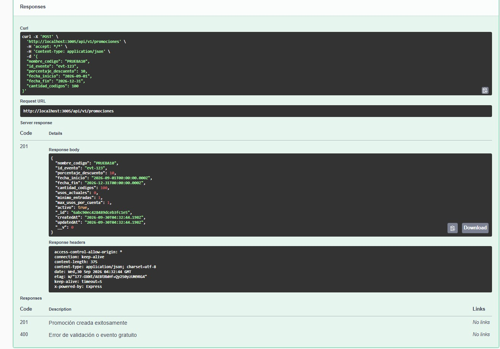
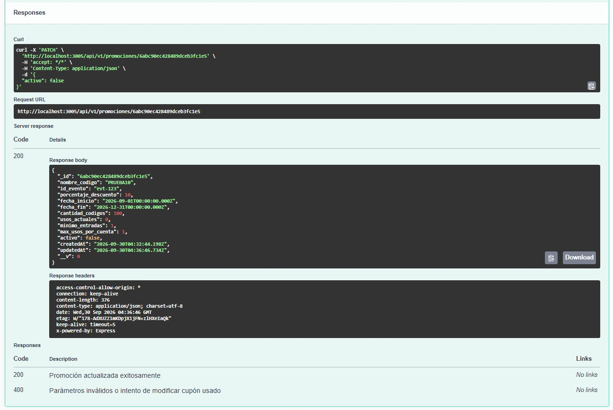
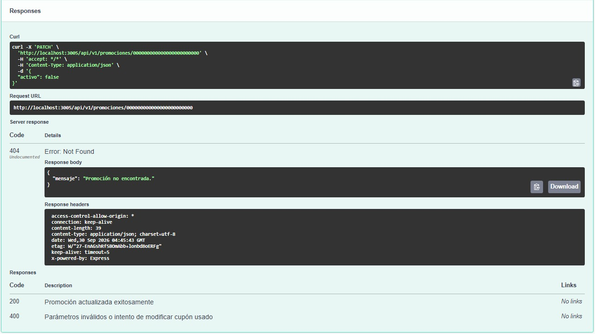
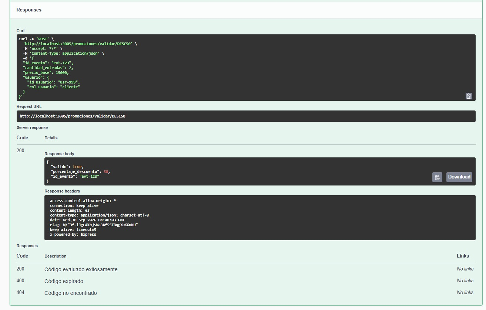
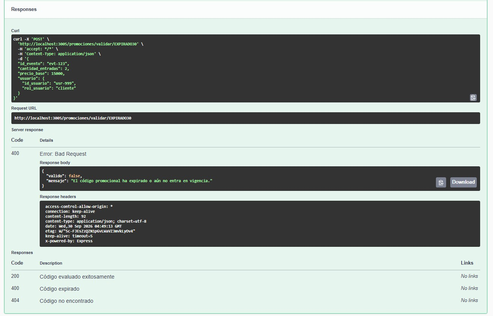
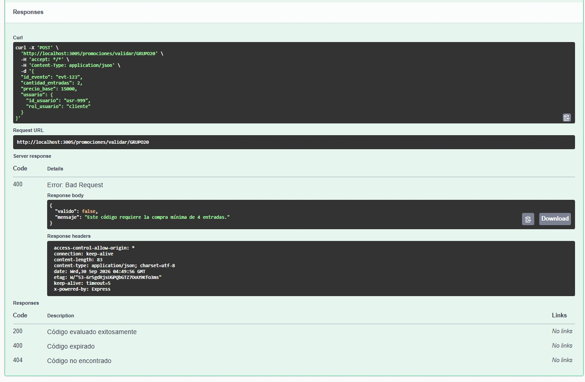
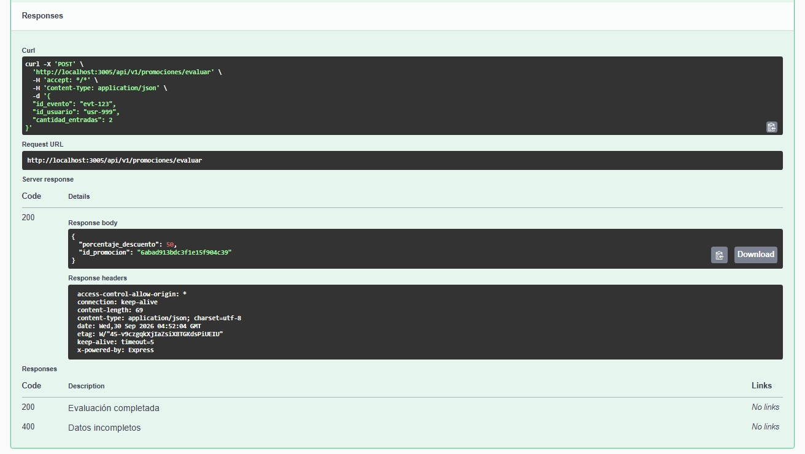
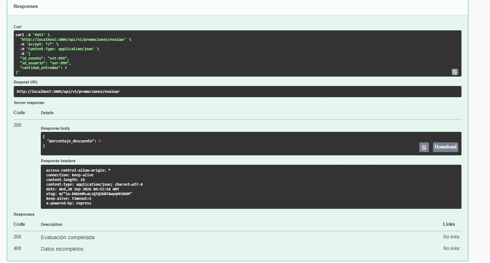

# Evidencias de Pruebas de Funcionalidad - Microservicio Promociones

**Fecha de ejecución:** 30 de Septiembre de 2026  
**Entorno de pruebas:** Localhost (Node.js/Express) + MongoDB Atlas  
**Herramienta de verificación:** OpenAPI / Swagger UI (`http://localhost:3005/api-docs`)

---

## Resumen de Casos de Prueba Ejecutados

| ID Caso | Módulo / Endpoint | Escenario Evaluado | Entrada | Resultado Esperado | Resultado Obtenido | Estado |
| :--- | :--- | :--- | :--- | :--- | :--- | :--- |
| **TC-01** | `POST /api/v1/promociones` | Creación de nuevo cupón | Payload con código `PRUEBA10` | Código `201 Created` con ID asignado | Cupón persistido con éxito | **APROBADO** |
| **TC-02** | `PATCH /api/v1/promociones/:id` | Desactivación de promoción activa | `activo: false` | Código `200 OK`, `activo: false` | Promoción desactivada | **APROBADO** |
| **TC-03** | `PATCH /api/v1/promociones/:id` | Control de error por ID inexistente | `id_promocion: "000000000000000000000000"` | Código `404 Not Found` | Código `404` con mensaje controlado | **APROBADO** |
| **TC-04** | `POST /promociones/validar/:codigo` | Validación Checkout - Cupón vigente | Código `DESC50`, 2 entradas | Código `200 OK`, `valido: true`, `50%` desc. | Código `200 OK`, descuento calculado | **APROBADO** |
| **TC-05** | `POST /promociones/validar/:codigo` | Validación Checkout - Cupón expirado | Código `EXPIRADO30` | Código `400 Bad Request`, `valido: false` | Código `400 Bad Request`, cupón expirado | **APROBADO** |
| **TC-06** | `POST /promociones/validar/:codigo` | Validación Checkout - Mínimo de entradas | Código `GRUPO20`, 2 entradas (requiere 4) | Código `400 Bad Request`, `valido: false` | Código `400 Bad Request`, no cumple mínimo | **APROBADO** |
| **TC-07** | `POST /api/v1/promociones/evaluar` | Integración Entradas - Evento con promo | `id_evento: "evt-123"`, 2 entradas | Código `200 OK` con promoción activa (50%) | Código `200 OK` con datos de promo | **APROBADO** |
| **TC-08** | `POST /api/v1/promociones/evaluar` | Integración Entradas - Evento sin promo | `id_evento: "evt-999"`, 2 entradas | Código `200 OK`, `porcentaje_descuento: 0` | Código `200 OK` sin descuento aplicado | **APROBADO** |

---

## Capturas de Evidencia

### TC-01: Creación de nuevo cupón promocional (Código 201)

### TC-02: Desactivación de promoción activa (Código 200)

### TC-03: Control de error 404 por ID inexistente

### TC-04: Validación Checkout - Cupón Vigente (Código 200)

### TC-05: Validación Checkout - Rechazo por Expiración (Código 400)

### TC-06: Validación Checkout - Rechazo por Mínimo de Entradas (Código 400)

### TC-07: Evaluación para Entradas - Promoción Aplicable (Código 200)

### TC-08: Evaluación para Entradas - Evento Sin Promoción (Código 200)

